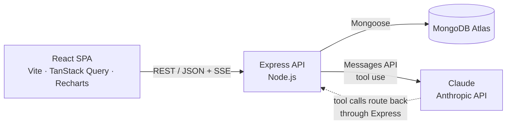

# Smart Expense Tracker

A full-stack MERN expense tracker with an **agentic AI assistant** that can analyze your spending — and record expenses from natural language ("add 450 for lunch today").

**Live demo:** [smart-expense-tracker.vercel.app](https://smart-expense-tracker-seven-xi.vercel.app/) · **API:** [smart-expense-tracker.onrender.com](https://smartexpensetracker-2evd.onrender.com/health)

> ⏱️ Note: the backend runs on Render's free tier and spins down when idle — the first request after a quiet period can take 30–60 seconds to cold-start.


Dashboard screenshot

---


## What it does

- **Monthly dashboard** — total spend with month-over-month delta, top categories (donut), and a 6-month spending trend (bar chart), all computed server-side by MongoDB aggregation pipelines in a single round trip
- **Transactions** — add expenses via a form, view recent activity, delete inline; the dashboard updates instantly through TanStack Query cache invalidation
- **AI insights chat** — an agentic assistant built on the Anthropic API with tool use. It answers questions like *"why was last month higher than usual?"* by querying the real database, and can **write** — *"add 500 for groceries"* creates a scoped, validated expense record
- **Streaming responses** — Server-Sent Events over an authenticated POST, streaming *through* a multi-turn tool-use loop with live status updates ("Checking your spending summary…")
- **Auth & hardening** — JWT authentication, per-user data isolation enforced at the query layer, and tiered rate limiting (per-user on chat, per-IP with failure-only counting on login)


## Architecture




The AI layer lives entirely on the backend. The React app never sees the Anthropic key — it talks only to `/api/chat`, and Claude's tool calls are executed server-side against MongoDB.

### The agentic loop

`POST /api/chat` implements a bounded tool-use loop:

1. Client sends the conversation history (the API is stateless)
2. Server calls Claude with a system prompt + 4 tool definitions
3. If Claude responds with `tool_use` → execute the matching MongoDB query/write → append the `tool_result` → call Claude again
4. When Claude produces a final text answer, stream it to the client (max 6 iterations as a circuit breaker)

**Tools:** `get_spending_summary` · `get_category_breakdown` · `query_expenses` (reads) · `add_expense` (write)

A `wroteData` flag travels down the stream, so the moment the AI records an expense, the frontend invalidates its query cache and the totals, charts, and transaction list update without a refresh.

## Design decisions

**The model never chooses whose data to touch.** User identity comes from the verified JWT and is injected server-side into every tool executor — there is no tool parameter for it. Even a prompt-injected *"show me user X's expenses"* has no lever to pull. The model decides *what* to do; the server decides *who* it happens to and *whether it's allowed*.

**Money is stored as integer paise.** Amounts live in the database as integers (₹500 → `50000`), avoiding floating-point drift in aggregated totals. Conversion to rupees happens only at the render boundary (frontend) and the AI boundary (tool inputs/outputs are in rupees, so the model reads human units and never performs unit arithmetic — the server does the deterministic ×100).

**Analytics are pushed into the database.** The dashboard is served by one `/summary` endpoint running four aggregation pipelines in parallel (`Promise.all`) — totals, top categories, and a gap-filled 6-month trend — over a compound `{ userId: 1, date: -1 }` index. The client never downloads raw transactions to sum them.

**Tool errors are conversational, not fatal.** Executor validation failures return `{ error: ... }` as a tool result instead of throwing, so the model recovers gracefully ("that amount doesn't look right — how much was it?") rather than the endpoint returning a 500.

**Streaming through the loop.** SSE is hand-rolled over `fetch` + `ReadableStream` (the browser's `EventSource` can't send an `Authorization` header or use POST). Text deltas stream as they arrive; tool executions emit status events; a terminal `done` event carries `wroteData`. The frame parser buffers across network chunk boundaries.

**Cost controls.** The chat endpoint is rate-limited per authenticated user (30 messages/hour → worst case ~180 upstream API calls/hour/user given the 6-iteration cap), and the server aborts the loop if the client disconnects mid-stream.

## Tech stack


| Layer           | Choices                                                                     |
| --------------- | --------------------------------------------------------------------------- |
| Frontend        | React 18, Vite, TanStack Query, Recharts, Axios                             |
| Backend         | Node.js, Express, Mongoose                                                  |
| Database        | MongoDB Atlas (aggregation pipelines, compound indexes)                     |
| AI              | Anthropic API (`@anthropic-ai/sdk`), Claude Sonnet, tool use, SSE streaming |
| Auth & security | JWT, bcrypt, express-rate-limit, CORS allow-list                            |
| Deployment      | Vercel (frontend), Render (API), Atlas (DB)                                 |


## API surface


| Method | Route                   | Auth | Description                                              |
| ------ | ----------------------- | ---- | -------------------------------------------------------- |
| POST   | `/api/auth/register`    | –    | Create account, returns JWT                              |
| POST   | `/api/auth/login`       | –    | Login, returns JWT                                       |
| GET    | `/api/expenses?limit=N` | ✅    | Recent transactions (newest first)                       |
| POST   | `/api/expenses`         | ✅    | Create expense (amount in paise)                         |
| PATCH  | `/api/expenses/:id`     | ✅    | Update own expense                                       |
| DELETE | `/api/expenses/:id`     | ✅    | Delete own expense                                       |
| GET    | `/api/expenses/summary` | ✅    | Dashboard aggregates (totals, categories, 6-month trend) |
| POST   | `/api/chat`             | ✅    | Agentic AI chat (SSE stream)                             |
| GET    | `/health`               | –    | Liveness check                                           |


All authenticated reads/writes are scoped by the token's user ID at the query level (`findOne({ _id, userId })`), so guessing another user's document ID returns a 404.

## Running locally

**Prerequisites:** Node 20+, a MongoDB Atlas cluster (free M0 works), an Anthropic API key.

```bash
git clone https://github.com/<you>/expense-tracker.git
cd expense-tracker
```

**Backend:**

```bash
cd server
npm install
cp .env.example .env   # then fill in the values below
npm run dev            # http://localhost:5000
```

`server/.env`:

```
PORT=5000
MONGODB_URI=mongodb+srv://<user>:<password>@<cluster>/expense_tracker?retryWrites=true&w=majority
JWT_SECRET=<64-char random hex — node -e "console.log(require('crypto').randomBytes(32).toString('hex'))">
JWT_EXPIRES_IN=7d
ANTHROPIC_API_KEY=sk-ant-...
CLIENT_ORIGIN=http://localhost:5173
```

**Frontend:**

```bash
cd client
npm install
echo "VITE_API_URL=http://localhost:5000/api" > .env
npm run dev            # http://localhost:5173
```

**Seed data (optional):** `node server/scripts/seed.js` scatters sample expenses across the last 6 months so the charts have something to show. ⚠️ It wipes the expenses collection first.

## Known tradeoffs

Choices made deliberately for a free-tier portfolio deployment, with the production alternative noted:

- **JWT in** `localStorage` — readable by page JavaScript, so an XSS bug means token theft. Production: httpOnly cookie + CSRF protection.
- **In-memory rate limiting** — counters reset on cold start and don't coordinate across instances. Production: shared store (Redis via `rate-limit-redis`, a drop-in for the same middleware).
- **Atlas network access open (**`0.0.0.0/0`**)** — Render's free tier has no stable egress IPs. Production: VPC peering / private endpoints.
- **Single-model, bounded agent** — a hard 6-iteration cap instead of more sophisticated agent orchestration; the right call for a scoped domain with 4 tools.


## Roadmap

- [ ] Budgets per category with AI-flagged overruns
- [ ] CSV import for bank statements
- [ ] Recurring expense detection
- [ ] Redis-backed rate limiting

---

Built by **Suraj** · [LinkedIn](#) · [GitHub](#)